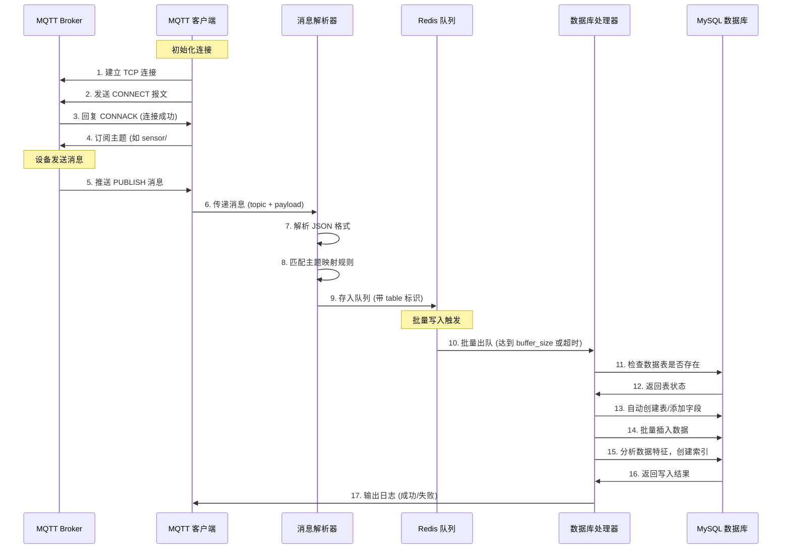

# ThinkPHP MQTT 数据采集扩展包

**tp-mqtt-collector** 是一个专为 ThinkPHP 设计的 MQTT 数据采集扩展包，支持自动解析 JSON 消息、动态映射数据库表、自动建表、字段类型识别和索引建议，适用于物联网(IoT)数据采集场景。

---

## 一、功能特点

✅ **MQTT 协议支持**：基于 Workerman/MQTT 实现高性能 MQTT 客户端  
✅ **断线自动重连**：网络异常或 Broker 断开时自动尝试重连  
✅ **Redis 消息队列**：使用 Redis 缓存消息，防止数据丢失  
✅ **批量写入 MySQL**：提高数据库写入性能  
✅ **JSON 自动解析**：自动识别 JSON 格式消息  
✅ **字段类型自动识别**：根据值自动映射 MySQL 字段类型  
✅ **主题动态映射表结构**：不同主题的消息可写入不同的数据表  
✅ **自动建表/添加字段**：首次收到消息时自动创建数据表和缺失字段  
✅ **自动索引建议**：根据数据特征自动建议并创建索引  
✅ **ThinkPHP 命令行启动**：符合 ThinkPHP 开发习惯

---

## 二、系统架构图

```mermaid
graph TD
    A[MQTT Broker] -->|发布消息| B[MQTT 客户端<br>(Workerman/MQTT)]
    B -->|断线重连| A
    B -->|接收消息| C[消息解析器<br>(Parser.php)]
    C -->|结构化数据| D[Redis 消息队列<br>(RedisQueue.php)]
    D -->|批量触发/定时触发| E[数据库处理器<br>(DbHandler.php)]
    E -->|自动建表/加字段| F[MySQL 数据库]
    E -->|自动索引建议| F
    G[ThinkPHP 命令行] -->|启动/停止| B
    style A fill:#f9f,stroke:#333,stroke-width:2px
    style B fill:#9f9,stroke:#333,stroke-width:2px
    style D fill:#99f,stroke:#333,stroke-width:2px
    style F fill:#ff9,stroke:#333,stroke-width:2px
```

---

## 三、消息流程图



---

## 四、安装方法

### 1. 安装扩展包
```bash
composer require phoneda/tp-mqtt-collector
```

### 2. 发布配置文件
```bash
php think vendor:publish
```
选择 `think\mqtt\ConfigProvider` 发布配置文件到 `config/mqtt.php`

---

## 五、配置说明

配置文件位置：`config/mqtt.php`

```php
return [
    'mqtt' => [
        'host'      => '127.0.0.1', // MQTT Broker 地址
        'port'      => 1883,        // MQTT 端口
        'username'  => '',          // 用户名
        'password'  => '',          // 密码
        'client_id' => 'tp_mqtt_' . uniqid(),
        'topics'    => ['sensor/#', 'device/#'], // 订阅的主题
    ],
    'redis' => [
        'host'     => '127.0.0.1',
        'port'     => 6379,
        'password' => '',
        'db'       => 0,
    ],
    'buffer_size'    => 100, // 批量写入数量
    'buffer_timeout' => 5,   // 批量写入超时时间(秒)
    'index_suggestion' => [
        'enabled'         => true,   // 是否启用索引建议
        'min_selectivity' => 0.1,    // 最低选择性要求
        'check_frequency' => 1000,   // 检查频率(处理多少条数据后检查一次)
    ],
    'topic_map' => [
        'sensor/+/temp' => [
            'table'    => 'sensor_temp',
            'fields'   => ['device_id', 'temperature', 'humidity'],
            'required' => ['device_id', 'temperature']
        ],
        'device/+/status' => [
            'table'    => 'device_status',
            'fields'   => ['device_id', 'status', 'battery'],
            'required' => ['device_id', 'status']
        ]
    ],
    'default_table' => 'mqtt_messages', // 默认表
];
```

---

## 六、使用方法

### 1. 启动 MQTT 数据采集服务
```bash
php think mqtt:consumer
```

### 2. 后台运行
```bash
php think mqtt:consumer start -d
```

### 3. 停止服务
```bash
php think mqtt:consumer stop
```

---

## 七、功能说明

### 1. MQTT 消息处理流程
1. 客户端连接 MQTT Broker 并订阅指定主题
2. 收到消息后进行 JSON 解析
3. 根据主题匹配到对应的数据库表
4. 将解析后的数据存入 Redis 队列
5. 当队列达到指定数量或超时后，批量写入 MySQL
6. 自动创建数据表和缺失字段
7. 根据数据特征自动创建索引

### 2. 主题映射规则
- 使用 MQTT 通配符 `+`（单层）和 `#`（多层）
- 每个规则可以指定：
  - `table`：目标数据表名
  - `fields`：需要解析的字段列表
  - `required`：必需字段列表

### 3. 自动建表和字段类型识别
- 自动创建 `id`、`topic`、`created_at` 基础字段
- 根据 JSON 值类型自动映射 MySQL 类型：
  - `bool` → `TINYINT(1)`
  - `int` → `INT`
  - `float` → `DECIMAL(10,2)`
  - `array/object` → `JSON`
  - `string` → `VARCHAR(255)`

### 4. 自动索引建议
- 根据字段选择性（唯一值比例）自动建议索引
- 只对高选择性字段创建索引
- 避免重复索引

---

## 八、数据库表结构示例

默认表结构（自动创建）：
```sql
CREATE TABLE `mqtt_messages` (
  `id` bigint unsigned NOT NULL AUTO_INCREMENT,
  `topic` varchar(255) NOT NULL,
  `payload` text,
  `created_at` datetime NOT NULL,
  PRIMARY KEY (`id`),
  KEY `idx_topic` (`topic`),
  KEY `idx_created_at` (`created_at`)
) ENGINE=InnoDB DEFAULT CHARSET=utf8mb4;
```

自动创建的传感器数据表：
```sql
CREATE TABLE `sensor_temp` (
  `id` bigint unsigned NOT NULL AUTO_INCREMENT,
  `topic` varchar(255) NOT NULL,
  `device_id` varchar(255) NULL,
  `temperature` decimal(10,2) NULL,
  `humidity` decimal(10,2) NULL,
  `created_at` datetime NOT NULL,
  PRIMARY KEY (`id`),
  KEY `idx_topic` (`topic`),
  KEY `idx_created_at` (`created_at`)
) ENGINE=InnoDB DEFAULT CHARSET=utf8mb4;
```

---

## 九、测试方法

使用 `mosquitto_pub` 发布测试消息：
```bash
# 发布传感器温度消息
mosquitto_pub -t "sensor/dev001/temp" -m '{"device_id":"dev001","temperature":25.6,"humidity":60}'

# 发布设备状态消息
mosquitto_pub -t "device/dev002/status" -m '{"device_id":"dev002","status":1,"battery":3.7}'
```

查看数据库：
```sql
SELECT * FROM sensor_temp;
SELECT * FROM device_status;
```


## 十、常见问题

1. **MQTT 连接失败**：检查 Broker 地址、端口和认证信息
2. **Redis 连接失败**：检查 Redis 服务是否运行
3. **数据表创建失败**：检查数据库用户权限
4. **中文乱码**：确保数据库和表使用 utf8mb4 编码
5. **性能问题**：调整 `buffer_size` 和 `buffer_timeout` 参数

---

## 十一、许可证

MIT License

---

## 十二、致谢

- [Workerman/MQTT](https://github.com/walkor/mqtt) - PHP MQTT 客户端库
- [ThinkPHP](https://thinkphp.cn) - 优秀的 PHP 开发框架
- [Predis](https://github.com/nrk/predis) - PHP Redis 客户端

---